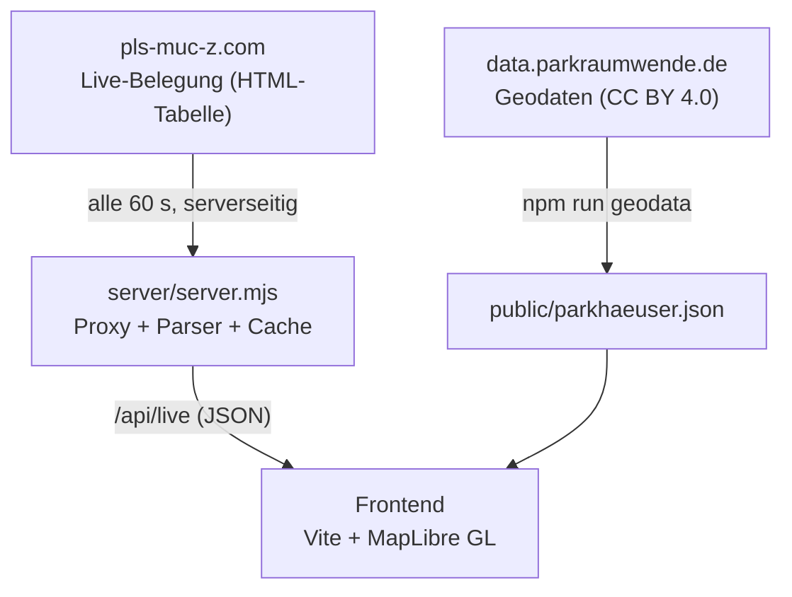

<!-- add Project Logo, if existing -->

# parken-muenchen

[![Made with love by it@M][made-with-love-shield]][itm-opensource]
[![MapLibre GL][maplibre-shield]](https://maplibre.org/)
[![Vite][vite-shield]](https://vitejs.dev/)
[![TypeScript][typescript-shield]](https://www.typescriptlang.org/)
<!-- feel free to add more shields, style 'for-the-badge' -> see https://shields.io/badges -->

Live-Auslastung der Parkhäuser in der Münchner Innenstadt auf einer interaktiven Karte – mobile first, mit Ampel-Markern, Detail-Panel und direkter Routenplanung über Google Maps, Apple Maps oder Waze.

Die Anwendung zeigt alle 24 Parkhäuser des Parkleitsystems Innenstadt (P1–P25) mit der Zahl freier Plätze direkt im Karten-Marker: grün (> 35 % frei), orange (12–35 %), rot (< 12 %), grau (Sensor offline – eingefrorene oder unplausible Werte werden nicht angezeigt). Ein Detail-Panel – Bottom Sheet auf Mobile, Seitenkarte auf Desktop – liefert Adresse, Auslastungsbalken, Betreiber-Link und Route-Buttons als reine Deep-Links ohne Tracking. Dazu kommen eine nach freien Plätzen sortierte Listen-Ansicht, eine „In meiner Nähe“-Funktion per Browser-Geolocation und Auto-Refresh alle 60 Sekunden mit Kennzeichnung veralteter Daten bei Quellausfall. Screenreader-Labels, Tastaturbedienung, Fokus-Management und `prefers-reduced-motion` sind berücksichtigt.

> **Hinweis:** Prototyp-Status – bis zur offiziellen Freigabe ist die Anwendung entsprechend gekennzeichnet (Prototyp-Badge, Disclaimer, `noindex`).

### Screenshots des Prototyps


### Built With

The documentation project is built with technologies we use in our projects:

* [Vite](https://vitejs.dev/) (Build & Dev-Server)
* [TypeScript](https://www.typescriptlang.org/)
* [MapLibre GL JS](https://maplibre.org/) mit [OpenFreeMap](https://openfreemap.org/)-Tiles (kein API-Key erforderlich)
* [Node.js](https://nodejs.org/) (dependency-freier Daten-Proxy)

## Roadmap

* [ ] Deployment (Vercel / Netlify / Cloudflare Pages) mit Serverless-Wrapper um `server/parser.mjs`
* [ ] Offizielle Datenquelle der Stadt statt Scraping (Voraussetzung für Produktivbetrieb)
* [ ] Impressum & Datenschutzerklärung
* [ ] Offizielles Corporate Design der Landeshauptstadt München

See the [open issues](https://github.com/it-at-m/liveparking/issues) for a full list of proposed features (and known issues).

## Set up

Voraussetzung: Node.js ≥ 22.12 (Vite 8; getestet mit v22.23.1). Der Daten-Proxy in `server/` ist dependency-frei und läuft auch mit älteren Node-Versionen.

```bash
npm install

# Terminal 1: Daten-Proxy
npm run proxy        # → http://localhost:8787/api/live

# Terminal 2: Frontend
npm run dev          # → http://localhost:5173
```

| Skript            | Zweck                                                       |
| ----------------- | ----------------------------------------------------------- |
| `npm run dev`     | Vite-Dev-Server, leitet `/api` an den Proxy weiter          |
| `npm run proxy`   | Lokaler Daten-Proxy (Fetch, Parser, 60-s-Cache)             |
| `npm run build`   | Production-Build nach `dist/`                               |
| `npm run geodata` | `public/parkhaeuser.json` aus den Quelldaten neu generieren |

## Documentation

### Architektur



* **`server/parser.mjs`** parst die Live-Tabelle: graue Zeilen = Sensor offline (`aktiv: false`), die zwei Hauptbahnhof-Zeilen (S/N 106525, Einfahrt Nord/Süd) werden zu einem Standort summiert.
* **`server/server.mjs`** cached 60 s im Speicher und liefert bei Upstream-Fehlern den letzten guten Stand mit `stale: true` aus. Keine npm-Abhängigkeiten.
* **`scripts/build-geodata.mjs`** generiert `public/parkhaeuser.json` aus den Parkraumwende-Geodaten und verifiziert das Matching gegen die Live-Quelle (Schlüssel: Seriennummer `sn`).
* Zur Laufzeit gilt die Kapazität aus den Live-Daten; `kapRef` aus den Geodaten ist nur Fallback.

### Projektstruktur

```
├── index.html              App-Gerüst (Header, Karte, Liste, Panel, Info-Dialog)
├── src/
│   ├── main.ts             Karte, Marker, Ansichten, Standort, Statuszeile
│   ├── panel.ts            Detail-Panel (Bottom Sheet / Seitenkarte) mit Route-Buttons
│   ├── liste.ts            Listen-Ansicht
│   ├── routen.ts           Deep-Links für Google Maps, Apple Maps, Waze
│   ├── types.ts            Geteilte Typen, Ampel-Logik, Distanzberechnung
│   └── style.css           Design in muenchen.de-Anmutung, mobile first
├── server/
│   ├── parser.mjs          Purer Parser für die Live-Tabelle (auch für Serverless nutzbar)
│   └── server.mjs          Lokaler HTTP-Proxy mit Cache und Stale-Fallback
├── scripts/
│   └── build-geodata.mjs   Geodaten-Generierung inkl. Matching-Verifikation
└── public/
    └── parkhaeuser.json    24 Parkhäuser: Name, Adresse, Koordinaten, Betreiber-URL
```

### Datenquellen

* Live-Belegung: [Parkleitsystem München](https://pls-muc-z.com/pls/info/parkhaus.html) – keine offizielle API; der Proxy fragt serverseitig maximal einmal pro Minute an
* Standorte & Adressen: Parkraumwende München, [data.parkraumwende.de](https://data.parkraumwende.de/), CC BY 4.0
* Karte: [OpenFreeMap](https://openfreemap.org/) · © OpenMapTiles · Daten von [OpenStreetMap](https://www.openstreetmap.org/copyright)-Mitwirkenden

## Contributing

Contributions are what make the open source community such an amazing place to learn, inspire, and create. Any contributions you make are **greatly appreciated**.

If you have a suggestion that would make this better, please open an issue with the tag "enhancement", fork the repo and create a pull request. You can also simply open an issue with the tag "enhancement".
Don't forget to give the project a star! Thanks again!

1. Open an issue with the tag "enhancement"
2. Fork the Project
3. Create your Feature Branch (`git checkout -b feature/AmazingFeature`)
4. Commit your Changes (`git commit -m 'Add some AmazingFeature'`)
5. Push to the Branch (`git push origin feature/AmazingFeature`)
6. Open a Pull Request

More about this in the [CODE_OF_CONDUCT](/CODE_OF_CONDUCT.md) file.


## License

Distributed under the MIT License. See [LICENSE](LICENSE) file for more information.


## Contact

it@M - opensource@muenchen.de

<!-- project shields / links -->
[made-with-love-shield]: https://img.shields.io/badge/made%20with%20%E2%9D%A4%20by-it%40M-yellow?style=for-the-badge
[itm-opensource]: https://opensource.muenchen.de/
[maplibre-shield]: https://img.shields.io/badge/MapLibre%20GL-396CB2?style=for-the-badge&logo=maplibre&logoColor=white
[vite-shield]: https://img.shields.io/badge/Vite-646CFF?style=for-the-badge&logo=vite&logoColor=white
[typescript-shield]: https://img.shields.io/badge/TypeScript-3178C6?style=for-the-badge&logo=typescript&logoColor=white
